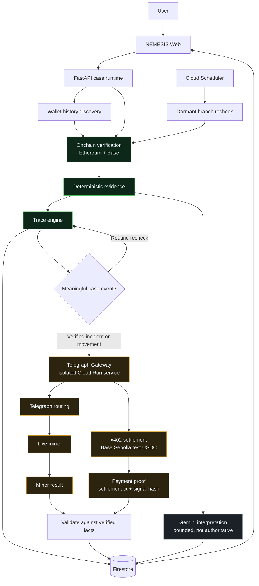

# NEMESIS

**Autonomous stolen-fund investigations that verify what happened onchain, trace where funds move, and purchase independent intelligence from live Telegraph miners as the case evolves.**

| | |
|---|---|
| **Live app** | https://nemesis-telegraph-web-h7bnd6kzfq-uc.a.run.app |
| **Public demo** (no sign-in) | https://nemesis-telegraph-web-h7bnd6kzfq-uc.a.run.app/?case=NMS-TG-DEMO-002 |
| **Telegraph track** | Track 3 — Applications |
| **Network** | Base Sepolia · x402 · test USDC |

---

## What it does

A victim usually knows one thing: their wallet. Everything else has to be discovered.

```
Affected wallet
  → likely incident identified from wallet history
  → transaction verified onchain
  → stolen funds traced across branches
  → a meaningful case event triggers Telegraph
  → live miner routed
  → x402 test-USDC payment settles
  → miner intelligence persisted with payment proof
  → investigation keeps monitoring for new movement
```

No step in that chain asks the user to identify their own theft transaction, and no step
waits on Telegraph to continue.

---

## Why Telegraph matters

NEMESIS can prove what happened on a chain. It cannot know what the rest of the world
has already seen. That gap is where a real investigation stalls, and it is exactly what
Telegraph fills.

The split is strict:

- **NEMESIS establishes blockchain truth.** Transaction existence, status, transfers,
  amounts, destinations, graph edges and branch state come from independent chain
  verification and nothing else.
- **Telegraph supplies paid external intelligence.** Independent miners are asked about
  a transaction or a destination once the chain evidence justifies the question.
- **NEMESIS validates that intelligence before using it.** A miner answer is checked
  against verified facts and classified before it is allowed to appear as a finding. It
  can add context. It can never overwrite a chain fact.

### Intents actually used

| Intent | Purpose | Settled calls |
|---|---|---:|
| `FRAUD_DETECTION` | Risk context on a verified destination or transaction | 8 |
| `ONCHAIN_TX_LOOKUP` | Independent read of a transaction NEMESIS already verified | 3 |

`NEWS_SEARCH` is implemented behind a narrow public-context trigger but has not fired in
production, so it is not claimed as used. The
[integration ledger](docs/TELEGRAPH_INTEGRATION_LEDGER.md) tracks it honestly.

### Paid does not mean useful

A miner can settle a payment and still tell you nothing. One live response confidently
claimed a well-known analytics firm had flagged an address as high risk. The "address"
was a transaction hash, and the payload declared `mode: knowledge` — an LLM answering
from memory rather than data.

Every paid response is therefore classified:

| State | Meaning |
|---|---|
| **Accepted intelligence** | A real observation, compatible with verified facts |
| **No case-specific signal** | Answered, but non-committal or recalled rather than observed |
| **Conflicted** | Substantively contradicts the chain; recorded, never accepted |

Only an accepted answer is shown in its own words or counted as intelligence. Everything
else keeps its receipt, its settlement proof and its full raw payload for audit. This is
per-result validation, not a reputation system: no miner is blacklisted for one answer.

---

## Live proof

Real, settled, and independently checked against the chain:

- **11 settled x402 payments** on Base Sepolia in test USDC, all within a hard allowlist
  of network, asset, payee and amount
- **4 different miners** answered across those calls; the routed miner is read from each
  response rather than assumed, because rank never predicted it
- **All 11 receipts carry a signal hash**, persisted only because Telegraph returned one
- **Every settlement verified independently** by reading the Base Sepolia transaction and
  confirming a single USDC transfer to the expected payee
- **Miner results render in the case UI** with cost, network, settlement reference and an
  explorer link
- **Disagreement and no-signal handling** are visible rather than hidden
- **Judge-triggered usage stays enabled** — the daily ceiling is funded so a new
  investigation really does buy intelligence

Evidence artifacts, including raw settled responses:

| File | What it proves |
|---|---|
| [`telegraph-smoke-2026-09-04.json`](docs/evidence/telegraph-smoke-2026-09-04.json) | Live registry, real x402 challenge, miner schemas |
| [`telegraph-settled-smoke-2026-09-05.json`](docs/evidence/telegraph-settled-smoke-2026-09-05.json) | First settled payment, verified on chain |
| [`telegraph-gateway-smoke-2026-09-05.json`](docs/evidence/telegraph-gateway-smoke-2026-09-05.json) | Gateway service paying end to end |
| [`telegraph-e2e-2026-09-05.json`](docs/evidence/telegraph-e2e-2026-09-05.json) | Full autonomous loop locally |
| [`telegraph-deployed-e2e-2026-09-05.json`](docs/evidence/telegraph-deployed-e2e-2026-09-05.json) | The same loop on deployed infrastructure |

---

## Architecture



Green is chain truth. Amber is paid external intelligence. Grey is interpretation. The
arrows never run the other way: nothing amber or grey writes into the green path.

A Telegraph outage cannot change branch state, alter evidence, or stop a trace. The
failure is persisted as a visible receipt and the investigation continues.

---

## Try it

**Fastest route, no account:** open the
[public demo case](https://nemesis-telegraph-web-h7bnd6kzfq-uc.a.run.app/?case=NMS-TG-DEMO-002).
It is read-only and shows the finished investigation, its Telegraph receipts and the
x402 payment proof.

**Run a real investigation:**

1. Open the [live app](https://nemesis-telegraph-web-h7bnd6kzfq-uc.a.run.app)
2. Sign in with email and password (creating a new investigation requires an account;
   reading a published case never does)
3. Enter an affected Ethereum or Base wallet address
4. NEMESIS discovers the incident, verifies it onchain, traces the funds, and purchases
   Telegraph intelligence when the case warrants it

The case screen is organised so each section answers one question: Overview (what
happened), Fund trace (where the funds went), Verified evidence (what we know for sure),
Telegraph intelligence (what external miners found), Assessment (what NEMESIS thinks it
means), Timeline (how the investigation progressed).

---

## Telegraph documentation

| Document | Contents |
|---|---|
| [Architecture decision](docs/TELEGRAPH_ARCHITECTURE_DECISION.md) | Why an isolated gateway, options compared, frozen receipt contract |
| [Live audit](docs/TELEGRAPH_LIVE_AUDIT.md) | Registry, leaderboard, miner schemas, x402 terms observed live |
| [Integration ledger](docs/TELEGRAPH_INTEGRATION_LEDGER.md) | Every capability with its status and evidence, including what is still blocked |
| [Evidence artifacts](docs/evidence/) | Raw settled responses and independent settlement checks |
| [First paid spike](docs/evidence/spike-telegraph-x402/) | The standalone program that made the first settled x402 payment |
| [Product requirements](nemesis-telegraph-prd.md) | The brief this build was written against |

---

## Evidence boundaries

| Plane | May establish | Never establishes |
|---|---|---|
| Onchain verification | transactions, transfers, amounts, timestamps, graph edges, branch state | anything external |
| Telegraph | what a miner returned, its routing and payment metadata | any blockchain fact, or any real-world identity |
| Gemini | classification, summary, prioritisation | any fact not already referenced |

A Telegraph result never becomes an identity claim. NEMESIS does not assert thief
identity, exchange account ownership, KYC access, or guaranteed recovery. Where the
evidence is not conclusive, the case says so: a close call between candidate outflows is
labelled a **likely incident** with its real confidence, not presented as proof.

---

## Spend safety

Telegraph costs real money, so the gateway is the only component that holds the payer key
or speaks x402, and it is not publicly reachable.

- Quote first, then check the challenge against a hard allowlist of network, asset,
  payee, scheme and amount — every refusal happens before anything is signed
- Ceilings per call, per case event and per day
- The daily counter lives in Firestore, so a container restart cannot reset it, and a
  counter that cannot be read refuses payment rather than assuming zero
- Payments run one at a time
- Idempotency is guarded twice: the event claim and the receipt claim
- Cloud Run IAM plus a separate shared secret in its own header

---

## Repository structure

```
app/                     Next.js case experience, Telegraph panels, evidence planes
backend/app/             FastAPI runtime, discovery, tracing, Telegraph client, receipts
backend/tests/           Backend test suite
gateway/                 Isolated TypeScript x402 gateway (payer key lives only here)
gateway/test/            Gateway test suite
docs/                    Telegraph architecture, audit, ledger and evidence
infra/                   Telegraph infrastructure bootstrap
scripts/                 Operational and evidence scripts
tests/                   Frontend tests
```

---

## Run it yourself

### Prerequisites

Node 22.13+, Python 3.12+, an Ethereum and a Base RPC endpoint, a Google Cloud project
with Firestore and Pub/Sub, and — for Telegraph — a low-balance Base Sepolia burner
holding test USDC.

### 1. Clone and configure

```bash
git clone https://github.com/jenzylove/nemesis-telegraph.git
cd nemesis-telegraph
cp .env.example .env
```

### 2. Run the API

```bash
cd backend
pip install -r requirements.txt
uvicorn app.main:app --reload --port 8080
```

### 3. Run the Telegraph gateway

The gateway is optional. Without it, tracing works and enrichment reports itself as
unavailable.

```bash
cd gateway
npm install
npm run build
TELEGRAPH_INTERNAL_TOKEN=<shared secret> \
TELEGRAPH_DAILY_USD=0.03 \
node dist/server.js
```

The payer key is read from `TELEGRAPH_EVM_PRIVATE_KEY`, or from a gitignored
`gateway/.env.local`. It must never reach the frontend or a commit.

Point the API at it with `TELEGRAPH_GATEWAY_URL` and the same
`TELEGRAPH_INTERNAL_TOKEN`.

### 4. Run the web app

```bash
npm install
npm run dev
```

### 5. Run the tests

```bash
cd backend && python -m pytest tests/ -q
cd gateway && npm test
npm test
```

### 6. Deploy

Three services, each with its own build file. They deploy under the
`nemesis-telegraph-*` namespace and share nothing with the frozen original deployment —
separate Firestore database, separate Pub/Sub topic, separate scheduler job, separate
secrets.

```bash
# Telegraph payment gateway (deploys with no unauthenticated access)
gcloud builds submit --config cloudbuild.gateway.yaml \
  --substitutions COMMIT_SHA=$(git rev-parse HEAD)

# Case runtime
gcloud builds submit --config cloudbuild.telegraph.yaml \
  --substitutions COMMIT_SHA=$(git rev-parse HEAD)

# Web app
gcloud builds submit --config cloudbuild.telegraph-frontend.yaml \
  --substitutions _GIT_SHA=$(git rev-parse HEAD)
```

Secrets expected in Secret Manager: `nemesis-telegraph-payer-key`,
`nemesis-telegraph-internal-token`, and the provider credentials referenced by
`cloudbuild.telegraph.yaml`.

### Verifying a deployment

Every service reports the commit it is running:

```bash
curl -s https://nemesis-telegraph-api-h7bnd6kzfq-uc.a.run.app/health
```

The `telegraph` block of that response shows gateway health, payer address, and today's
spend against the ceiling — without exposing a secret.

---

## Project lineage

NEMESIS existed before this extension. It was already an autonomous incident-response
system: wallet-first discovery, deterministic verification, multi-hop tracing, dormant
branch monitoring and automatic resume.

This repository continues that work from frozen commit
[`d51a672`](https://github.com/jenzylove/nemesis/commit/d51a672ae631170609bd3c1f867cb8f5ef10375c)
for Telegraph Hackathon Track 3. What Telegraph changed is not a feature bolted onto the
side: external intelligence became an autonomous, paid, verifiable part of every evolving
investigation, bought only when the chain evidence justifies the question and validated
before it is allowed to count.

The original [`jenzylove/nemesis`](https://github.com/jenzylove/nemesis) repository and
its production deployment are untouched and still running. Their build files are not
carried here, so nothing in this repository can accidentally deploy over them.
