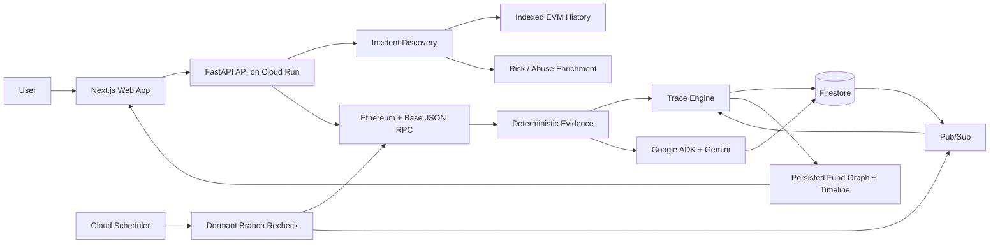
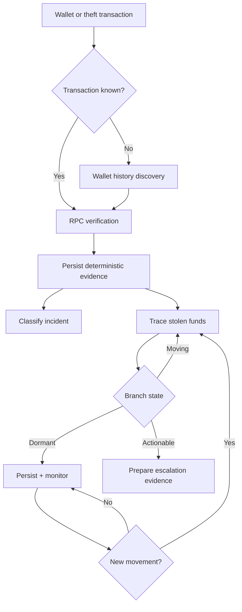

# NEMESIS

**Autonomous crypto incident response for tracing stolen funds, preserving deterministic evidence, and continuing investigations when fund movement resumes.**

> **Telegraph Track 3 fork:** This repository continues the frozen NEMESIS build from commit `d51a672ae631170609bd3c1f867cb8f5ef10375c` for the Telegraph Hackathon. The original NEMESIS repository and production deployment remain separate. The current checkpoint contains research and feasibility evidence only; full Telegraph integration has not begun.

**Live app:** https://nemesis-web-h7bnd6kzfq-uc.a.run.app

NEMESIS starts from an affected wallet or known theft transaction, identifies and verifies suspicious outflow, traces stolen assets across subsequent transactions, persists every branch of the investigation, and keeps dormant paths under monitoring so tracing can resume automatically when funds move again.

## Why NEMESIS

Traditional block explorers expose transactions. NEMESIS turns those transactions into a persistent incident investigation.

The system separates deterministic blockchain evidence from model interpretation. Transaction receipts, transfer logs, timestamps, amounts, branch paths, and graph state are collected and persisted first. Agent reasoning is applied only after that evidence exists.

## Core capabilities

- Wallet-first incident discovery when the theft transaction is unknown
- Direct investigation from a known theft transaction
- Deterministic Ethereum and Base transaction verification
- Multi-hop stolen-fund tracing
- Split branch detection and persistence
- Swap and supported bridge continuation
- Dormant branch monitoring and automatic trace resume
- Persistent case graph, timeline, evidence, and branch state
- Evidence-grounded incident classification with Google ADK and Gemini on Vertex AI
- Risk enrichment and public abuse-report context with guarded attribution

## Architecture



### Investigation flow



## System design

### Evidence first

The blockchain evidence layer owns transaction facts, transfer paths, amounts, timestamps, graph structure, and branch state. Model output cannot replace or invent those facts.

### Persistent investigations

Each case is stored with its evidence, branches, graph nodes and edges, timeline, monitoring state, and provenance. A case can continue after the original browser session ends.

### Autonomous monitoring

When a traced path stops moving, NEMESIS marks that branch dormant instead of treating the investigation as finished. Scheduled rechecks examine the branch again. Confirmed movement creates a new event and tracing resumes from the persisted branch state.

### Guarded interpretation

Google ADK and Gemini classify and summarize verified evidence. Findings remain tied to evidence references and explicit limitations. NEMESIS does not infer a real-world identity from an address alone.

## Production stack

| Layer | Technology |
| --- | --- |
| Frontend | Next.js / React |
| API | FastAPI |
| Cloud runtime | Google Cloud Run |
| Persistence | Firestore |
| Agent runtime | Google ADK |
| Model | Gemini 3.5 Flash on Vertex AI |
| Eventing | Google Cloud Pub/Sub |
| Monitoring | Google Cloud Scheduler |
| Chain evidence | Ethereum and Base JSON RPC |
| Incident discovery | Alchemy historical transfers |
| Risk context | GoPlus and Chainabuse |

## Real investigation path

A user can begin with an affected wallet alone or provide a known theft transaction.

When the transaction is unknown, NEMESIS searches indexed wallet activity for incident candidates, scores them using deterministic signals, and then independently verifies the selected candidate through blockchain RPC before it is admitted into the investigation.

Once verified, NEMESIS persists the evidence, classifies the likely compromise mechanism, creates trace branches, recursively follows qualifying fund movement, and exposes the resulting graph and timeline to the case workspace.

## Monitoring lifecycle

A trace branch can move through investigation states such as `MOVING`, `DORMANT`, `OBSCURED`, and `ACTIONABLE`.

Dormant does not mean complete. It means the currently visible trail has stopped moving. NEMESIS keeps that branch in persistent state and rechecks it for confirmed outgoing movement. When movement appears, tracing resumes from the exact stored branch rather than rebuilding the case from scratch.

## Safety and evidence boundaries

NEMESIS is an investigation and evidence system. It does not claim access to exchange customer records, private KYC data, fund-freezing powers, law-enforcement systems, or guaranteed asset recovery.

It does not claim:

- a thief's real-world identity from an address alone
- exchange account holder details
- customer UID, email, or KYC access
- guaranteed exchange cooperation
- guaranteed fund recovery

Attribution and escalation remain bounded by the evidence available to the system.

## Repository structure

```text
app/        Web application and investigation workspace
backend/    FastAPI API, evidence pipeline, tracing, monitoring, and agents
docs/       Architecture and implementation notes
infra/      Google Cloud deployment/bootstrap resources
```

For a deeper technical breakdown of the evidence boundary, trace lifecycle, persistence model, monitoring loop, and integration limits, see [`docs/ARCHITECTURE.md`](docs/ARCHITECTURE.md).

## Verification

The repository includes automated backend and frontend verification through GitHub Actions. Real investigation paths have been exercised against Ethereum and Base with persisted Firestore case state, trace branches, graph updates, timeline events, dormant monitoring, and agent-generated structured findings.

Synthetic demo data is kept separate from the real investigation path and is labelled as demo state in the UI.


## Run it yourself

Everything below is the same path this project is built and deployed through.

### Prerequisites

- Node.js 22.13+ and Python 3.12
- A Google Cloud project with billing enabled
- A Firebase web app in that project, with Google and Email/Password sign-in enabled
- An Alchemy key (wallet-only discovery needs indexed history) and an Ethereum + Base
  JSON-RPC endpoint. Bitquery, GoPlus and Chainabuse are optional and degrade cleanly.

### 1. Clone and configure

```bash
git clone https://github.com/jenzylove/nemesis.git
cd nemesis
cp .env.example .env      # .env is git-ignored; never commit real credentials
```

Fill in `.env`. The four `NEXT_PUBLIC_FIREBASE_*` values come from your Firebase web
app config, and `GOOGLE_CLOUD_PROJECT` / `FIRESTORE_PROJECT_ID` are your project id.

### 2. Run the API

```bash
cd backend
python -m pip install -r requirements.txt
uvicorn app.main:app --reload --port 8080
```

`GET http://localhost:8080/health` reports which runtime, agent and providers actually
resolved, so it is the fastest way to confirm your configuration took effect.

### 3. Run the web app

```bash
npm install --no-audit --no-fund
NEXT_PUBLIC_NEMESIS_API_URL=http://localhost:8080 npm run dev
```

Open the printed URL. The landing page is public; authentication is required only when
an investigation is submitted or a saved case is opened.

### 4. Run the tests

```bash
npm test                                    # frontend
cd backend && python -m pytest -q tests      # backend
```

### 5. Deploy to Google Cloud

Create the Firestore database, the Pub/Sub topic, its authenticated push subscription to
`/internal/events/pubsub`, and a Cloud Scheduler job hitting `/internal/monitoring/tick`
every five minutes. `infra/bootstrap-gcp.sh` provisions these. Store provider credentials
in Secret Manager under the names referenced by `cloudbuild.yaml`.

```bash
# API
gcloud builds submit --config cloudbuild.yaml   --substitutions COMMIT_SHA=$(git rev-parse HEAD)

# Web app. Substitutions are comma-separated, and the Firebase values are compiled
# into the bundle at build time rather than read at runtime.
gcloud builds submit --config cloudbuild.frontend.yaml   --substitutions _API_URL=https://YOUR-API-URL,_FIREBASE_API_KEY=YOUR_KEY,_FIREBASE_AUTH_DOMAIN=YOUR_PROJECT.firebaseapp.com,_FIREBASE_PROJECT_ID=YOUR_PROJECT,_FIREBASE_APP_ID=YOUR_APP_ID
```

Add the deployed web app domain to Firebase Authentication's authorized domains, or
sign-in will be rejected in the browser.

### Verifying a deployment

`GET /health` returns the running `git_sha`. Comparing it against `git rev-parse HEAD`
confirms the deployed runtime matches the repository.

The landing page is public. Firebase authentication is required only when an investigation is submitted or a persisted case is opened. Alchemy supplies historical candidates, Bitquery supplies realtime movement signals when configured, and Ethereum/Base JSON-RPC independently verifies every piece of evidence admitted to a case.
